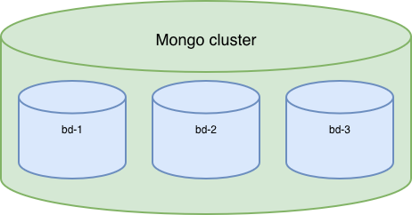

### CHIAUSA Antoine - INFO 4A FISA

---

## Rapport Livrable 3 - Configuration du Replica Set

---

## Schéma de l'architecture



Voici un schéma simple de notre cluster. `bd-1`, `bd-2` et `bd-3` ont les mêmes données pour assurer 2 réplications de données. Cependant, seulement un seul d'entre eux sera considéré comme "PRIMAIRE". C'est sur celui-ci que l'on vient écrire et ensuite les 2 secondaires recopient les données écrites dessus.

## Configuration du Replica Set

#### Initialisation du réplicat set avec la commande de l'énoncé :

```javascript
test> rs.initiate({
| _id: "rs0",
| members: [
| { _id: 0, host: "localhost:27017" },
| { _id: 1, host: "localhost:27018" },
| { _id: 2, host: "localhost:27019" }
| ]
| })
{
  ok: 1,
  '$clusterTime': {
    clusterTime: Timestamp({ t: 1767888773, i: 1 }),
    signature: {
      hash: Binary.createFromBase64('AAAAAAAAAAAAAAAAAAAAAAAAAAA=', 0),
      keyId: Long('0')
    }
  },
  operationTime: Timestamp({ t: 1767888773, i: 1 })
}
rs0 [direct: secondary]
```

#### Vérification avec `rs.status()`
```javascript
rs.status()
{
  set: 'rs0',
  date: ISODate('2026-01-08T16:13:17.009Z'),
  myState: 1,
  term: Long('1'),
  syncSourceHost: '',
  syncSourceId: -1,
  heartbeatIntervalMillis: Long('2000'),
  majorityVoteCount: 2,
  writeMajorityCount: 2,
  votingMembersCount: 3,
  writableVotingMembersCount: 3,
  optimes: {
    lastCommittedOpTime: { ts: Timestamp({ t: 1767888784, i: 16 }), t: Long('1') },
    lastCommittedWallTime: ISODate('2026-01-08T16:13:04.594Z'),
    readConcernMajorityOpTime: { ts: Timestamp({ t: 1767888784, i: 16 }), t: Long('1') },
    appliedOpTime: { ts: Timestamp({ t: 1767888784, i: 16 }), t: Long('1') },
    durableOpTime: { ts: Timestamp({ t: 1767888784, i: 16 }), t: Long('1') },
    writtenOpTime: { ts: Timestamp({ t: 1767888784, i: 16 }), t: Long('1') },
    lastAppliedWallTime: ISODate('2026-01-08T16:13:04.594Z'),
    lastDurableWallTime: ISODate('2026-01-08T16:13:04.594Z'),
    lastWrittenWallTime: ISODate('2026-01-08T16:13:04.594Z')
  },
  lastStableRecoveryTimestamp: Timestamp({ t: 1767888773, i: 1 }),
  electionCandidateMetrics: {
    lastElectionReason: 'electionTimeout',
    lastElectionDate: ISODate('2026-01-08T16:13:04.426Z'),
    electionTerm: Long('1'),
    lastCommittedOpTimeAtElection: { ts: Timestamp({ t: 1767888773, i: 1 }), t: Long('-1') },
    lastSeenWrittenOpTimeAtElection: { ts: Timestamp({ t: 1767888773, i: 1 }), t: Long('-1') },
    lastSeenOpTimeAtElection: { ts: Timestamp({ t: 1767888773, i: 1 }), t: Long('-1') },
    numVotesNeeded: 2,
    priorityAtElection: 1,
    electionTimeoutMillis: Long('10000'),
    numCatchUpOps: Long('0'),
    newTermStartDate: ISODate('2026-01-08T16:13:04.492Z'),
    wMajorityWriteAvailabilityDate: ISODate('2026-01-08T16:13:04.973Z')
  },
  members: [
    {
      _id: 0,
      name: 'localhost:27017',
      health: 1,
      state: 1,
      stateStr: 'PRIMARY',
      uptime: 961,
      optime: { ts: Timestamp({ t: 1767888784, i: 16 }), t: Long('1') },
      optimeDate: ISODate('2026-01-08T16:13:04.000Z'),
      optimeWritten: { ts: Timestamp({ t: 1767888784, i: 16 }), t: Long('1') },
      optimeWrittenDate: ISODate('2026-01-08T16:13:04.000Z'),
      lastAppliedWallTime: ISODate('2026-01-08T16:13:04.594Z'),
      lastDurableWallTime: ISODate('2026-01-08T16:13:04.594Z'),
      lastWrittenWallTime: ISODate('2026-01-08T16:13:04.594Z'),
      syncSourceHost: '',
      syncSourceId: -1,
      infoMessage: 'Could not find member to sync from',
      electionTime: Timestamp({ t: 1767888784, i: 1 }),
      electionDate: ISODate('2026-01-08T16:13:04.000Z'),
      configVersion: 1,
      configTerm: 1,
      self: true,
      lastHeartbeatMessage: ''
    },
    {
      _id: 1,
      name: 'localhost:27018',
      health: 1,
      state: 2,
      stateStr: 'SECONDARY',
      uptime: 23,
      optime: { ts: Timestamp({ t: 1767888784, i: 16 }), t: Long('1') },
      optimeDurable: { ts: Timestamp({ t: 1767888784, i: 16 }), t: Long('1') },
      optimeWritten: { ts: Timestamp({ t: 1767888784, i: 16 }), t: Long('1') },
      optimeDate: ISODate('2026-01-08T16:13:04.000Z'),
      optimeDurableDate: ISODate('2026-01-08T16:13:04.000Z'),
      optimeWrittenDate: ISODate('2026-01-08T16:13:04.000Z'),
      lastAppliedWallTime: ISODate('2026-01-08T16:13:04.594Z'),
      lastDurableWallTime: ISODate('2026-01-08T16:13:04.594Z'),
      lastWrittenWallTime: ISODate('2026-01-08T16:13:04.594Z'),
      lastHeartbeat: ISODate('2026-01-08T16:13:16.465Z'),
      lastHeartbeatRecv: ISODate('2026-01-08T16:13:15.470Z'),
      pingMs: Long('0'),
      lastHeartbeatMessage: '',
      syncSourceHost: 'localhost:27017',
      syncSourceId: 0,
      infoMessage: '',
      configVersion: 1,
      configTerm: 1
    },
    {
      _id: 2,
      name: 'localhost:27019',
      health: 1,
      state: 2,
      stateStr: 'SECONDARY',
      uptime: 23,
      optime: { ts: Timestamp({ t: 1767888784, i: 16 }), t: Long('1') },
      optimeDurable: { ts: Timestamp({ t: 1767888784, i: 16 }), t: Long('1') },
      optimeWritten: { ts: Timestamp({ t: 1767888784, i: 16 }), t: Long('1') },
      optimeDate: ISODate('2026-01-08T16:13:04.000Z'),
      optimeDurableDate: ISODate('2026-01-08T16:13:04.000Z'),
      optimeWrittenDate: ISODate('2026-01-08T16:13:04.000Z'),
      lastAppliedWallTime: ISODate('2026-01-08T16:13:04.594Z'),
      lastDurableWallTime: ISODate('2026-01-08T16:13:04.594Z'),
      lastWrittenWallTime: ISODate('2026-01-08T16:13:04.594Z'),
      lastHeartbeat: ISODate('2026-01-08T16:13:16.465Z'),
      lastHeartbeatRecv: ISODate('2026-01-08T16:13:16.974Z'),
      pingMs: Long('0'),
      lastHeartbeatMessage: '',
      syncSourceHost: 'localhost:27017',
      syncSourceId: 0,
      infoMessage: '',
      configVersion: 1,
      configTerm: 1
    }
  ],
  ok: 1,
  '$clusterTime': {
    clusterTime: Timestamp({ t: 1767888784, i: 16 }),
    signature: {
      hash: Binary.createFromBase64('AAAAAAAAAAAAAAAAAAAAAAAAAAA=', 0),
      keyId: Long('0')
    }
  },
  operationTime: Timestamp({ t: 1767888784, i: 16 })
}
```

#### Import sur le replica primaire (`db-1` : port 27017)
Pour importer les données, j'ai utilisé ces deux lignes de codes (j'ai configuré le port du standalone sur 27020 juste pour la copie des données dans `bd-1`): 
```javascript
mongodump --port=27020 --out=/tmp/mongodb_backup
mongorestore --port=27017 /tmp/mongodb_backup
```
On passe par un repertoire temporaire `mongo_backup` qu'on importe ensuite dans `bd-1`, le primaire du replica set.

Ensuite on vérifie que les données ont bien été importées :
```javascript
% mongosh --port 27017
Current Mongosh Log ID: 695fe686fd6a388c05da211c
Connecting to:          mongodb://127.0.0.1:27017/?directConnection=true&serverSelectionTimeoutMS=2000&appName=mongosh+2.5.10
Using MongoDB:          8.2.3
Using Mongosh:          2.5.10

For mongosh info see: https://www.mongodb.com/docs/mongodb-shell/

------
   The server generated these startup warnings when booting
   2026-01-08T16:57:16.773+01:00: Access control is not enabled for the database. Read and write access to data and configuration is unrestricted
------

rs0 [direct: primary] test> show dbs
admin         112.00 KiB
cineexplorer    1.05 GiB
config        268.00 KiB
local          68.63 MiB
```

## Test de tolérance aux pannes

#### 1. État initial
On voit bien que `bd-1 : 27017` est bien le **primaire** tandis que `bd-2 : 27018` et `bd-3 : 27019` sont des secondaires.

#### 2. Écriture
Après insertion des documents dans `bd-1`, on voit bien que les données ont été répliquées dans `bd-2` et `bd3`. On remarque que dans les réplicas, les collections sont plus lourdes. Cela est normal car en plus des données du primaire, les secondaires stockent également des Oplog (Logs opérationnels) d'où la grosse différence pour local et des métadonnées sur l'état de la réplication.

 - `bd-2` : 
```javascript 
% mongosh localhost:27018
Current Mongosh Log ID: 695fe54c306e8d075702adb1
Connecting to:          mongodb://localhost:27018/?directConnection=true&serverSelectionTimeoutMS=2000&appName=mongosh+2.5.10
Using MongoDB:          8.2.3
Using Mongosh:          2.5.10

For mongosh info see: https://www.mongodb.com/docs/mongodb-shell/

------
   The server generated these startup warnings when booting
   2026-01-08T16:57:22.582+01:00: Access control is not enabled for the database. Read and write access to data and configuration is unrestricted
------

rs0 [direct: secondary] test> show dbs
admin         112.00 KiB
cineexplorer    1.12 GiB
config        264.00 KiB
local         640.51 MiB
```
 - `bd-3` : 
```javascript
% mongosh --port 27019
Current Mongosh Log ID: 695fe60b2aa7dbb0eba5e634
Connecting to:          mongodb://127.0.0.1:27019/?directConnection=true&serverSelectionTimeoutMS=2000&appName=mongosh+2.5.10
Using MongoDB:          8.2.3
Using Mongosh:          2.5.10

For mongosh info see: https://www.mongodb.com/docs/mongodb-shell/

------
   The server generated these startup warnings when booting
   2026-01-08T16:57:30.301+01:00: Access control is not enabled for the database. Read and write access to data and configuration is unrestricted
------

rs0 [direct: secondary] test> show dbs
admin         112.00 KiB
cineexplorer    1.11 GiB
config        276.00 KiB
local         576.00 MiB
```
#### 3. Panne Primary
On commence par arrêter le  `db-1` avec la commande `db.shutdownServer()`. Ensuite on refait `rs.status()` :
```javascript
rs.status()
{
  set: 'rs0',
  date: ISODate('2026-01-08T17:28:08.939Z'),
  myState: 1,
  term: Long('2'),
  syncSourceHost: '',
  syncSourceId: -1,
  heartbeatIntervalMillis: Long('2000'),
  majorityVoteCount: 2,
  writeMajorityCount: 2,
  votingMembersCount: 3,
  writableVotingMembersCount: 3,
  optimes: {
    lastCommittedOpTime: { ts: Timestamp({ t: 1767893282, i: 1 }), t: Long('2') },
    lastCommittedWallTime: ISODate('2026-01-08T17:28:02.026Z'),
    readConcernMajorityOpTime: { ts: Timestamp({ t: 1767893282, i: 1 }), t: Long('2') },
    appliedOpTime: { ts: Timestamp({ t: 1767893282, i: 1 }), t: Long('2') },
    durableOpTime: { ts: Timestamp({ t: 1767893282, i: 1 }), t: Long('2') },
    writtenOpTime: { ts: Timestamp({ t: 1767893282, i: 1 }), t: Long('2') },
    lastAppliedWallTime: ISODate('2026-01-08T17:28:02.026Z'),
    lastDurableWallTime: ISODate('2026-01-08T17:28:02.026Z'),
    lastWrittenWallTime: ISODate('2026-01-08T17:28:02.026Z')
  },
  lastStableRecoveryTimestamp: Timestamp({ t: 1767893262, i: 1 }),
  electionCandidateMetrics: {
    lastElectionReason: 'stepUpRequestSkipDryRun',
    lastElectionDate: ISODate('2026-01-08T17:25:31.909Z'),
    electionTerm: Long('2'),
    lastCommittedOpTimeAtElection: { ts: Timestamp({ t: 1767893126, i: 1 }), t: Long('1') },
    lastSeenWrittenOpTimeAtElection: { ts: Timestamp({ t: 1767893126, i: 1 }), t: Long('1') },
    lastSeenOpTimeAtElection: { ts: Timestamp({ t: 1767893126, i: 1 }), t: Long('1') },
    numVotesNeeded: 2,
    priorityAtElection: 1,
    electionTimeoutMillis: Long('10000'),
    priorPrimaryMemberId: 0,
    numCatchUpOps: Long('0'),
    newTermStartDate: ISODate('2026-01-08T17:25:31.961Z'),
    wMajorityWriteAvailabilityDate: ISODate('2026-01-08T17:25:31.987Z')
  },
  electionParticipantMetrics: {
    votedForCandidate: true,
    electionTerm: Long('1'),
    lastVoteDate: ISODate('2026-01-08T16:13:04.435Z'),
    electionCandidateMemberId: 0,
    voteReason: '',
    lastWrittenOpTimeAtElection: { ts: Timestamp({ t: 1767888773, i: 1 }), t: Long('-1') },
    maxWrittenOpTimeInSet: { ts: Timestamp({ t: 1767888773, i: 1 }), t: Long('-1') },
    lastAppliedOpTimeAtElection: { ts: Timestamp({ t: 1767888773, i: 1 }), t: Long('-1') },
    maxAppliedOpTimeInSet: { ts: Timestamp({ t: 1767888773, i: 1 }), t: Long('-1') },
    priorityAtElection: 1
  },
  members: [
    {
      _id: 0,
      name: 'localhost:27017',
      health: 0,
      state: 8,
      stateStr: '(not reachable/healthy)',
      uptime: 0,
      optime: { ts: Timestamp({ t: 0, i: 0 }), t: Long('-1') },
      optimeDurable: { ts: Timestamp({ t: 0, i: 0 }), t: Long('-1') },
      optimeWritten: { ts: Timestamp({ t: 0, i: 0 }), t: Long('-1') },
      optimeDate: ISODate('1970-01-01T00:00:00.000Z'),
      optimeDurableDate: ISODate('1970-01-01T00:00:00.000Z'),
      optimeWrittenDate: ISODate('1970-01-01T00:00:00.000Z'),
      lastAppliedWallTime: ISODate('2026-01-08T17:25:41.968Z'),
      lastDurableWallTime: ISODate('2026-01-08T17:25:41.968Z'),
      lastWrittenWallTime: ISODate('2026-01-08T17:25:41.968Z'),
      lastHeartbeat: ISODate('2026-01-08T17:28:08.212Z'),
      lastHeartbeatRecv: ISODate('2026-01-08T17:25:46.466Z'),
      pingMs: Long('0'),
      lastHeartbeatMessage: 'Error connecting to localhost:27017 (127.0.0.1:27017) :: caused by :: onInvoke :: caused by :: Connection refused',
      syncSourceHost: '',
      syncSourceId: -1,
      infoMessage: '',
      configVersion: 1,
      configTerm: 2
    },
    {
      _id: 1,
      name: 'localhost:27018',
      health: 1,
      state: 1,
      stateStr: 'PRIMARY',
      uptime: 5446,
      optime: { ts: Timestamp({ t: 1767893282, i: 1 }), t: Long('2') },
      optimeDate: ISODate('2026-01-08T17:28:02.000Z'),
      optimeWritten: { ts: Timestamp({ t: 1767893282, i: 1 }), t: Long('2') },
      optimeWrittenDate: ISODate('2026-01-08T17:28:02.000Z'),
      lastAppliedWallTime: ISODate('2026-01-08T17:28:02.026Z'),
      lastDurableWallTime: ISODate('2026-01-08T17:28:02.026Z'),
      lastWrittenWallTime: ISODate('2026-01-08T17:28:02.026Z'),
      syncSourceHost: '',
      syncSourceId: -1,
      infoMessage: '',
      electionTime: Timestamp({ t: 1767893131, i: 1 }),
      electionDate: ISODate('2026-01-08T17:25:31.000Z'),
      configVersion: 1,
      configTerm: 2,
      self: true,
      lastHeartbeatMessage: ''
    },
    {
      _id: 2,
      name: 'localhost:27019',
      health: 1,
      state: 2,
      stateStr: 'SECONDARY',
      uptime: 4514,
      optime: { ts: Timestamp({ t: 1767893282, i: 1 }), t: Long('2') },
      optimeDurable: { ts: Timestamp({ t: 1767893282, i: 1 }), t: Long('2') },
      optimeWritten: { ts: Timestamp({ t: 1767893282, i: 1 }), t: Long('2') },
      optimeDate: ISODate('2026-01-08T17:28:02.000Z'),
      optimeDurableDate: ISODate('2026-01-08T17:28:02.000Z'),
      optimeWrittenDate: ISODate('2026-01-08T17:28:02.000Z'),
      lastAppliedWallTime: ISODate('2026-01-08T17:28:02.026Z'),
      lastDurableWallTime: ISODate('2026-01-08T17:28:02.026Z'),
      lastWrittenWallTime: ISODate('2026-01-08T17:28:02.026Z'),
      lastHeartbeat: ISODate('2026-01-08T17:28:08.058Z'),
      lastHeartbeatRecv: ISODate('2026-01-08T17:28:07.061Z'),
      pingMs: Long('0'),
      lastHeartbeatMessage: '',
      syncSourceHost: 'localhost:27018',
      syncSourceId: 1,
      infoMessage: '',
      configVersion: 1,
      configTerm: 2
    }
  ],
  ok: 1,
  '$clusterTime': {
    clusterTime: Timestamp({ t: 1767893282, i: 1 }),
    signature: {
      hash: Binary.createFromBase64('AAAAAAAAAAAAAAAAAAAAAAAAAAA=', 0),
      keyId: Long('0')
    }
  },
  operationTime: Timestamp({ t: 1767893282, i: 1 })
}
```
On remarque dans la sortie précédente que comme `db-1` n'est plus accessible, `db-2` a été désigné comme primaire.

#### 4. Nouveau Primary
Dans le code précédent on remarque les lignes suivantes :
```javascript
electionCandidateMetrics: {
    lastElectionDate: ISODate('2026-01-08T17:25:31.909Z'),
    newTermStartDate: ISODate('2026-01-08T17:25:31.961Z'),
    //...
}
```
ce qui donne un temps d'élection d'environ 52ms.

#### 5. Lecture
- Vérification de la lecture sur `db-2` :
```javascript
mongosh localhost:20718
Current Mongosh Log ID: 695fefa40ee0c3389b26cc9a
Connecting to:          mongodb://localhost:20718/?directConnection=true&serverSelectionTimeoutMS=2000&appName=mongosh+2.5.10
MongoNetworkError: connect ECONNREFUSED 127.0.0.1:20718, connect ECONNREFUSED ::1:20718
(base) antoinechiausa@MacBook-Air-dAntoine cineexplorer_medium % mongosh localhost:27018
Current Mongosh Log ID: 695fefa80e335d47c8a8c431
Connecting to:          mongodb://localhost:27018/?directConnection=true&serverSelectionTimeoutMS=2000&appName=mongosh+2.5.10
Using MongoDB:          8.2.3
Using Mongosh:          2.5.10

For mongosh info see: https://www.mongodb.com/docs/mongodb-shell/

------
   The server generated these startup warnings when booting
   2026-01-08T16:57:22.582+01:00: Access control is not enabled for the database. Read and write access to data and configuration is unrestricted
------

rs0 [direct: primary] test> use cineexplorer
switched to db cineexplorer

rs0 [direct: primary] cineexplorer> db.persons.findOne({ primaryName : "Jean Dujardin"  })
{
  _id: ObjectId('69415909c9a2795c9a895294'),
  pid: 'nm0241121',
  primaryName: 'Jean Dujardin',
  birthYear: 1972,
  deathYear: null
}
```
- Vérification de la lecture sur `db-3` :
```javascript
mongosh localhost:27019
Current Mongosh Log ID: 695fef71c050afa74cf04de2
Connecting to:          mongodb://localhost:27019/?directConnection=true&serverSelectionTimeoutMS=2000&appName=mongosh+2.5.10
Using MongoDB:          8.2.3
Using Mongosh:          2.5.10

For mongosh info see: https://www.mongodb.com/docs/mongodb-shell/

------
   The server generated these startup warnings when booting
   2026-01-08T16:57:30.301+01:00: Access control is not enabled for the database. Read and write access to data and configuration is unrestricted
------
rs0 [direct: secondary] test> use cineexplorer
switched to db cineexplorer
rs0 [direct: secondary] cineexplorer> db.persons.findOne()
{
  _id: ObjectId('69415909c9a2795c9a886a8a'),
  pid: 'nm0000029',
  primaryName: 'Margaux Hemingway',
  birthYear: 1954,
  deathYear: 1996
}
```

#### 6. Reconnexion

```javascript
mongosh localhost:27017
Current Mongosh Log ID: 695ff1d65806fee761c54562
Connecting to:          mongodb://localhost:27017/?directConnection=true&serverSelectionTimeoutMS=2000&appName=mongosh+2.5.10
Using MongoDB:          8.2.3
Using Mongosh:          2.5.10

For mongosh info see: https://www.mongodb.com/docs/mongodb-shell/

------
   The server generated these startup warnings when booting
   2026-01-08T19:04:50.355+01:00: Access control is not enabled for the database. Read and write access to data and configuration is unrestricted
------

rs0 [direct: secondary] test> rs.status()
{
  set: 'rs0',
  date: ISODate('2026-01-08T18:05:18.525Z'),
  myState: 2,
  term: Long('2'),
  syncSourceHost: 'localhost:27018',
  syncSourceId: 1,
  heartbeatIntervalMillis: Long('2000'),
  majorityVoteCount: 2,
  writeMajorityCount: 2,
  votingMembersCount: 3,
  writableVotingMembersCount: 3,
  optimes: {
    lastCommittedOpTime: { ts: Timestamp({ t: 1767895512, i: 1 }), t: Long('2') },
    lastCommittedWallTime: ISODate('2026-01-08T18:05:12.876Z'),
    readConcernMajorityOpTime: { ts: Timestamp({ t: 1767895512, i: 1 }), t: Long('2') },
    appliedOpTime: { ts: Timestamp({ t: 1767895512, i: 1 }), t: Long('2') },
    durableOpTime: { ts: Timestamp({ t: 1767895512, i: 1 }), t: Long('2') },
    writtenOpTime: { ts: Timestamp({ t: 1767895512, i: 1 }), t: Long('2') },
    lastAppliedWallTime: ISODate('2026-01-08T18:05:12.876Z'),
    lastDurableWallTime: ISODate('2026-01-08T18:05:12.876Z'),
    lastWrittenWallTime: ISODate('2026-01-08T18:05:12.876Z')
  },
  lastStableRecoveryTimestamp: Timestamp({ t: 1767893141, i: 1 }),
  members: [
    {
      _id: 0,
      name: 'localhost:27017',
      health: 1,
      state: 2,
      stateStr: 'SECONDARY',
      uptime: 29,
      optime: { ts: Timestamp({ t: 1767895512, i: 1 }), t: Long('2') },
      optimeDate: ISODate('2026-01-08T18:05:12.000Z'),
      optimeWritten: { ts: Timestamp({ t: 1767895512, i: 1 }), t: Long('2') },
      optimeWrittenDate: ISODate('2026-01-08T18:05:12.000Z'),
      lastAppliedWallTime: ISODate('2026-01-08T18:05:12.876Z'),
      lastDurableWallTime: ISODate('2026-01-08T18:05:12.876Z'),
      lastWrittenWallTime: ISODate('2026-01-08T18:05:12.876Z'),
      syncSourceHost: 'localhost:27018',
      syncSourceId: 1,
      infoMessage: '',
      configVersion: 1,
      configTerm: 2,
      self: true,
      lastHeartbeatMessage: ''
    },
    {
      _id: 1,
      name: 'localhost:27018',
      health: 1,
      state: 1,
      stateStr: 'PRIMARY',
      uptime: 28,
      optime: { ts: Timestamp({ t: 1767895512, i: 1 }), t: Long('2') },
      optimeDurable: { ts: Timestamp({ t: 1767895512, i: 1 }), t: Long('2') },
      optimeWritten: { ts: Timestamp({ t: 1767895512, i: 1 }), t: Long('2') },
      optimeDate: ISODate('2026-01-08T18:05:12.000Z'),
      optimeDurableDate: ISODate('2026-01-08T18:05:12.000Z'),
      optimeWrittenDate: ISODate('2026-01-08T18:05:12.000Z'),
      lastAppliedWallTime: ISODate('2026-01-08T18:05:12.876Z'),
      lastDurableWallTime: ISODate('2026-01-08T18:05:12.876Z'),
      lastWrittenWallTime: ISODate('2026-01-08T18:05:12.876Z'),
      lastHeartbeat: ISODate('2026-01-08T18:05:17.421Z'),
      lastHeartbeatRecv: ISODate('2026-01-08T18:05:18.436Z'),
      pingMs: Long('0'),
      lastHeartbeatMessage: '',
      syncSourceHost: '',
      syncSourceId: -1,
      infoMessage: '',
      electionTime: Timestamp({ t: 1767893131, i: 1 }),
      electionDate: ISODate('2026-01-08T17:25:31.000Z'),
      configVersion: 1,
      configTerm: 2
    },
    {
      _id: 2,
      name: 'localhost:27019',
      health: 1,
      state: 2,
      stateStr: 'SECONDARY',
      uptime: 28,
      optime: { ts: Timestamp({ t: 1767895512, i: 1 }), t: Long('2') },
      optimeDurable: { ts: Timestamp({ t: 1767895512, i: 1 }), t: Long('2') },
      optimeWritten: { ts: Timestamp({ t: 1767895512, i: 1 }), t: Long('2') },
      optimeDate: ISODate('2026-01-08T18:05:12.000Z'),
      optimeDurableDate: ISODate('2026-01-08T18:05:12.000Z'),
      optimeWrittenDate: ISODate('2026-01-08T18:05:12.000Z'),
      lastAppliedWallTime: ISODate('2026-01-08T18:05:12.876Z'),
      lastDurableWallTime: ISODate('2026-01-08T18:05:12.876Z'),
      lastWrittenWallTime: ISODate('2026-01-08T18:05:12.876Z'),
      lastHeartbeat: ISODate('2026-01-08T18:05:17.421Z'),
      lastHeartbeatRecv: ISODate('2026-01-08T18:05:16.579Z'),
      pingMs: Long('0'),
      lastHeartbeatMessage: '',
      syncSourceHost: 'localhost:27018',
      syncSourceId: 1,
      infoMessage: '',
      configVersion: 1,
      configTerm: 2
    }
  ],
  ok: 1,
  '$clusterTime': {
    clusterTime: Timestamp({ t: 1767895512, i: 1 }),
    signature: {
      hash: Binary.createFromBase64('AAAAAAAAAAAAAAAAAAAAAAAAAAA=', 0),
      keyId: Long('0')
    }
  },
  operationTime: Timestamp({ t: 1767895512, i: 1 })
}
```

On remarque que `bd-1` qui était autrefois primaire, ne l'est plus car `bd-2` lui est resté le primaire.


#### 7. Double panne

Après avoir arrêté `db-1` et `db-2`, je tape `rs.status()` depuis `db-3` :
```javascript
% mongosh localhost:27019
Current Mongosh Log ID: 695ff297cebee1a1a113b009
Connecting to:          mongodb://localhost:27019/?directConnection=true&serverSelectionTimeoutMS=2000&appName=mongosh+2.5.10
Using MongoDB:          8.2.3
Using Mongosh:          2.5.10

For mongosh info see: https://www.mongodb.com/docs/mongodb-shell/

------
   The server generated these startup warnings when booting
   2026-01-08T16:57:30.301+01:00: Access control is not enabled for the database. Read and write access to data and configuration is unrestricted
------

rs0 [direct: secondary] test> rs.status()
{
  set: 'rs0',
  date: ISODate('2026-01-08T18:08:37.094Z'),
  myState: 2,
  term: Long('3'),
  syncSourceHost: '',
  syncSourceId: -1,
  heartbeatIntervalMillis: Long('2000'),
  majorityVoteCount: 2,
  writeMajorityCount: 2,
  votingMembersCount: 3,
  writableVotingMembersCount: 3,
  optimes: {
    lastCommittedOpTime: { ts: Timestamp({ t: 1767895688, i: 1 }), t: Long('3') },
    lastCommittedWallTime: ISODate('2026-01-08T18:08:08.774Z'),
    readConcernMajorityOpTime: { ts: Timestamp({ t: 1767895688, i: 1 }), t: Long('3') },
    appliedOpTime: { ts: Timestamp({ t: 1767895698, i: 1 }), t: Long('3') },
    durableOpTime: { ts: Timestamp({ t: 1767895698, i: 1 }), t: Long('3') },
    writtenOpTime: { ts: Timestamp({ t: 1767895698, i: 1 }), t: Long('3') },
    lastAppliedWallTime: ISODate('2026-01-08T18:08:18.777Z'),
    lastDurableWallTime: ISODate('2026-01-08T18:08:18.777Z'),
    lastWrittenWallTime: ISODate('2026-01-08T18:08:18.777Z')
  },
  lastStableRecoveryTimestamp: Timestamp({ t: 1767895672, i: 1 }),
  electionParticipantMetrics: {
    votedForCandidate: true,
    electionTerm: Long('2'),
    lastVoteDate: ISODate('2026-01-08T17:25:31.922Z'),
    electionCandidateMemberId: 1,
    voteReason: '',
    lastWrittenOpTimeAtElection: { ts: Timestamp({ t: 1767893126, i: 1 }), t: Long('1') },
    maxWrittenOpTimeInSet: { ts: Timestamp({ t: 1767893126, i: 1 }), t: Long('1') },
    lastAppliedOpTimeAtElection: { ts: Timestamp({ t: 1767893126, i: 1 }), t: Long('1') },
    maxAppliedOpTimeInSet: { ts: Timestamp({ t: 1767893126, i: 1 }), t: Long('1') },
    priorityAtElection: 1
  },
  members: [
    {
      _id: 0,
      name: 'localhost:27017',
      health: 0,
      state: 8,
      stateStr: '(not reachable/healthy)',
      uptime: 0,
      optime: { ts: Timestamp({ t: 0, i: 0 }), t: Long('-1') },
      optimeDurable: { ts: Timestamp({ t: 0, i: 0 }), t: Long('-1') },
      optimeWritten: { ts: Timestamp({ t: 0, i: 0 }), t: Long('-1') },
      optimeDate: ISODate('1970-01-01T00:00:00.000Z'),
      optimeDurableDate: ISODate('1970-01-01T00:00:00.000Z'),
      optimeWrittenDate: ISODate('1970-01-01T00:00:00.000Z'),
      lastAppliedWallTime: ISODate('2026-01-08T18:07:32.931Z'),
      lastDurableWallTime: ISODate('2026-01-08T18:07:32.931Z'),
      lastWrittenWallTime: ISODate('2026-01-08T18:07:32.931Z'),
      lastHeartbeat: ISODate('2026-01-08T18:08:36.864Z'),
      lastHeartbeatRecv: ISODate('2026-01-08T18:07:41.518Z'),
      pingMs: Long('0'),
      lastHeartbeatMessage: 'Error connecting to localhost:27017 (127.0.0.1:27017) :: caused by :: onInvoke :: caused by :: Connection refused',
      syncSourceHost: '',
      syncSourceId: -1,
      infoMessage: '',
      configVersion: 1,
      configTerm: 2
    },
    {
      _id: 1,
      name: 'localhost:27018',
      health: 0,
      state: 8,
      stateStr: '(not reachable/healthy)',
      uptime: 0,
      optime: { ts: Timestamp({ t: 0, i: 0 }), t: Long('-1') },
      optimeDurable: { ts: Timestamp({ t: 0, i: 0 }), t: Long('-1') },
      optimeWritten: { ts: Timestamp({ t: 0, i: 0 }), t: Long('-1') },
      optimeDate: ISODate('1970-01-01T00:00:00.000Z'),
      optimeDurableDate: ISODate('1970-01-01T00:00:00.000Z'),
      optimeWrittenDate: ISODate('1970-01-01T00:00:00.000Z'),
      lastAppliedWallTime: ISODate('2026-01-08T18:08:08.774Z'),
      lastDurableWallTime: ISODate('2026-01-08T18:08:08.774Z'),
      lastWrittenWallTime: ISODate('2026-01-08T18:08:08.774Z'),
      lastHeartbeat: ISODate('2026-01-08T18:08:36.862Z'),
      lastHeartbeatRecv: ISODate('2026-01-08T18:08:13.277Z'),
      pingMs: Long('0'),
      lastHeartbeatMessage: 'Error connecting to localhost:27018 (127.0.0.1:27018) :: caused by :: onInvoke :: caused by :: Connection refused',
      syncSourceHost: '',
      syncSourceId: -1,
      infoMessage: '',
      configVersion: 1,
      configTerm: 3
    },
    {
      _id: 2,
      name: 'localhost:27019',
      health: 1,
      state: 2,
      stateStr: 'SECONDARY',
      uptime: 7867,
      optime: { ts: Timestamp({ t: 1767895698, i: 1 }), t: Long('3') },
      optimeDate: ISODate('2026-01-08T18:08:18.000Z'),
      optimeWritten: { ts: Timestamp({ t: 1767895698, i: 1 }), t: Long('3') },
      optimeWrittenDate: ISODate('2026-01-08T18:08:18.000Z'),
      lastAppliedWallTime: ISODate('2026-01-08T18:08:18.777Z'),
      lastDurableWallTime: ISODate('2026-01-08T18:08:18.777Z'),
      lastWrittenWallTime: ISODate('2026-01-08T18:08:18.777Z'),
      syncSourceHost: '',
      syncSourceId: -1,
      infoMessage: '',
      configVersion: 1,
      configTerm: 3,
      self: true,
      lastHeartbeatMessage: ''
    }
  ],
  ok: 1,
  '$clusterTime': {
    clusterTime: Timestamp({ t: 1767895698, i: 1 }),
    signature: {
      hash: Binary.createFromBase64('AAAAAAAAAAAAAAAAAAAAAAAAAAA=', 0),
      keyId: Long('0')
    }
  },
  operationTime: Timestamp({ t: 1767895698, i: 1 })
}
```
On remarque que `db-3` reste secondaire malgré le fait qu'elle soit seule, nous n'avons donc plus de réplica primaire. C'est normal car sur un réplica set de 3 noeuds, il au moins 2 votes pour devenir primaire. Or `db-3` étant tout seul après l'arrêt de `db-1` et `db-2`, il ne peut pas obtenir ces 2 votes.